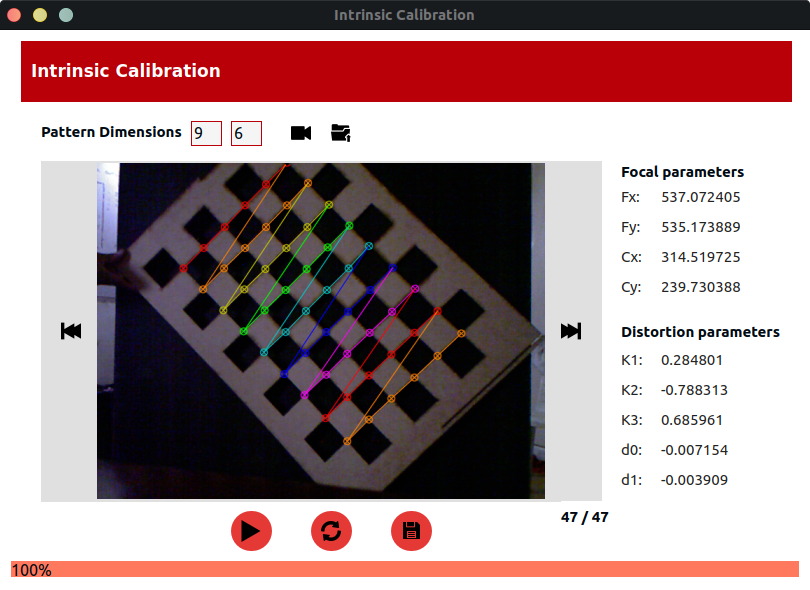

# **Intrinsic Calibration Cameras**

This is a simple desktop application to carry out the process of performing the intrinsic calibration of any camera as long as you have the appropriate calibration pattern for each camera. In this case there are the intrinsic parameters of three cameras: rgb, depth and thermal. Once the parameters are found, you can correct the distortion that your images present. The parameters are saved in a .json format file
## Intrinsic Calibration Results


```
{
    "focalParameters": {
        "Fx": 557.072405,
        "Fy": 535.173889,
        "Cx": 314.519725,
        "Cy": 239.730388
    },
    "distortionParameters": {
        "K1": 0.284801,
        "K2": -0.788313,
        "K3": 0.685961,
        "p1": -0.007154,
        "p2": -0.003909
    }
} 
```

## Dependencies
This project needs **[libfreenect](https://github.com/OpenKinect/libfreenect)** on your computer to enter the microsoft kinect camera. If you are using a different camera you need to modify the file **src/ models/DataAcquisition.py** and ready, you can use the application.

## Project Setup
```
    pip install -r requirements.txt
```
## Run Project
```
    python src/IntrinsicCalibrationWidget.py
```

